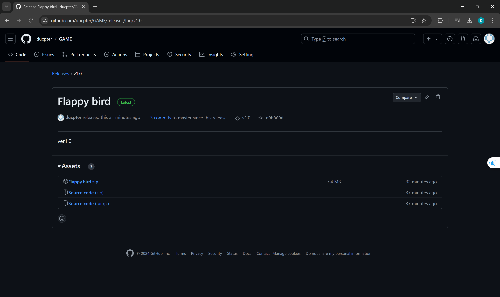
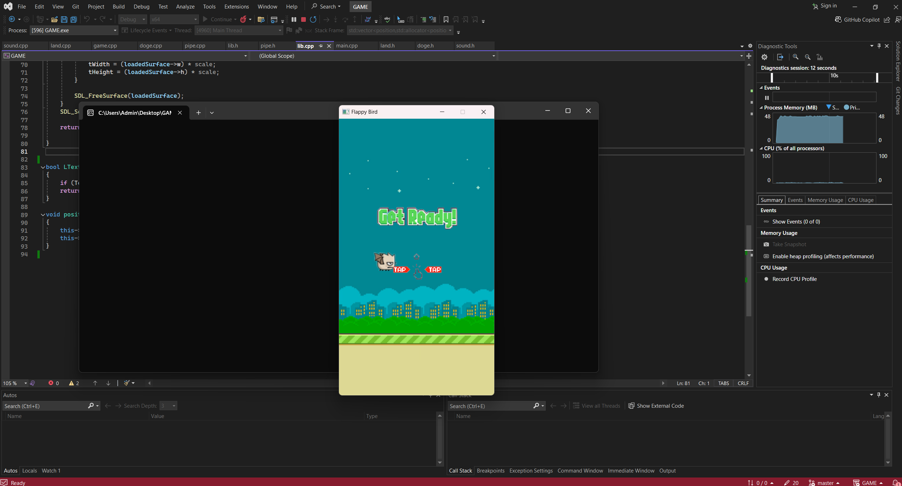

# Flappy Bird

## Giới thiệu chung

**Tên sản phẩm**: Flappy Bird  
**Họ và tên**: Phạm Văn Đức  
**MSSV**: 22024561  
**Lớp học phần**: 2324H_INT2215_70

## Demo Video

Xem video demo tại [YouTube](https://www.youtube.com/watch?v=kSdAvtmIgWk).

## Lời nói đầu
Flappy Bird là một trò chơi điện tử đơn giản nhưng vô cùng gây nghiện, được phát triển bởi Nguyễn Hà Đông. Người chơi điều khiển một chú chim bay qua các khe hẹp giữa những chiếc ống, với mỗi lần nhấn, chú chim sẽ bay lên một chút và trọng lực sẽ kéo chú chim xuống. Mục tiêu của trò chơi là đạt được số điểm cao nhất có thể bằng cách vượt qua nhiều ống nhất mà không va chạm vào chúng. Mặc dù gameplay cực kỳ đơn giản, Flappy Bird đã trở thành một hiện tượng toàn cầu nhờ độ khó đầy thử thách và khả năng khiến người chơi luôn muốn thử lại mỗi khi thất bại.

## Cách cài đặt game
### **Cách 1: Clone repo hoặc tải về từ GitHub và chạy bằng Visual Studio**
1. **Clone repo** hoặc chọn `Code` -> `Download Zip` tại [Github](https://github.com/ducpter/GAME).  
   
2. Giải nén file `.zip` đã tải về (nếu chọn `Download Zip`).
3. Mở file `GAME.sln` trong Visual Studio.
4. Bấm vào `Local Windows Debugger` để khởi động game.

### **Cách 2: Tải về file .zip và chạy trực tiếp file .exe**
1. Tải file `.zip` tại [link này](https://github.com/ducpter/GAME/releases/tag/v1.0).
   
2. Giải nén file đã tải về.
3. Tìm và mở file `GAME.exe` trong thư mục đã giải nén theo đường dẫn `Flappy bird\GAME\GAME.exe` để khởi động game.

## Cách chơi game

1. **Khởi động trò chơi**:
   - Chú chim sẽ xuất hiện trên màn hình sẵn sàng bay.
   - Nhấn phím `SPACE`, chuột trái hoặc `KEY_UP` để bắt đầu.

2. **Điều khiển chú chim**:
   - Mỗi lần nhấn phím `SPACE`, chuột trái hoặc `KEY_UP`, chú chim sẽ bay lên một đoạn ngắn.
   - Nếu không nhấn, chú chim sẽ rơi xuống do trọng lực.

3. **Mục tiêu**:
   - Điều khiển chú chim bay qua các khoảng trống giữa các cột ống và tránh va chạm với chúng.
   - Mỗi cột ống vượt qua thành công sẽ mang về 1 điểm.

4. **Trò chơi kết thúc**:
   - Trò chơi kết thúc nếu chú chim va chạm vào cột ống hoặc rơi xuống đất.
   - Sau khi trò chơi kết thúc, số điểm đạt được sẽ được hiển thị.
   - Người chơi có thể chơi lại để cải thiện số điểm.

5. **Tính năng thêm**:
   - Cột di chuyển: Tăng độ khó bằng cách cho các cột có tỉ lệ di chuyển.
   - Tùy chọn âm lượng và đổi giữa bản đồ sáng và tối.
   - Huy chương phù hợp để tôn vinh người chơi sau khi trò chơi kết thúc.

## Các thông tin chi tiết

- **Nhân vật chính**:
  - Flappy Bird  
    
  - Flappy Bat  
    
- **Vật cản**:
  - Ống nước (có tỉ lệ di chuyển)  
    
- **Cách thức điều khiển**: Sử dụng phím `SPACE`, chuột trái hoặc `KEY_UP`.
- **Âm thanh**: Âm thanh mô phỏng các hành động của chú chim.
- **Chức năng khác**: Chơi lại, đổi nhân vật, lưu điểm cao, v.v.

## Một vài hình ảnh từ game

1. **Khi bắt đầu game**:
   - ***Map sáng***
     
   - ***Map tối***
     

2. **Khi chơi game**:
   - ***Map sáng***
     
   - ***Map tối***
     
   - ***Pause Tab*** (Có thể điều chỉnh map sáng tối và âm thanh)
     - ****Map sáng****
       
     - ****Map tối****
       
     - ****Âm thanh bật****
       
     - ****Âm thanh tắt****
       

3. **Khi kết thúc**:
   - ***Huy chương cổ vũ***
     
   - ***Huy chương bạc***
     
   - ***Huy chương vàng***
     

## Các kỹ thuật được sử dụng

- Thư viện **SDL2** (hình ảnh, âm thanh, font chữ).
- Quản lý nhiều đối tượng như con chim, background, menu, v.v.
- Áp dụng kế thừa và đa hình trong lập trình hướng đối tượng.
- Lưu và ghi điểm cao qua file.
- Tính toán vật lý để mô phỏng độ rơi và góc nghiêng của con chim.
- Xử lý thời gian thực, thao tác chuột, âm thanh, hình ảnh và bàn phím.

## Các nguồn tham khảo

- Hình ảnh và âm thanh tìm kiếm trên Google và trên GitHub.
- [LazyFoo SDL Tutorial](https://lazyfoo.net/tutorials/SDL/index.php)
- [Askari Hassan's YouTube Channel](https://www.youtube.com/channel/UC2Ab_b49frkmgFJajOvtkpw)
- [Github - Flappy Bird](https://github.com/conglb/Flappy-Bird)

## Tổng kết

### Những kiến thức đã học được

- Hiểu cách chia, tách file.
- Thành thạo lập trình hướng đối tượng, đặc biệt là việc sử dụng class.
- Nâng cao kỹ thuật lập trình.
- Học cách thiết lập môi trường làm việc với thư viện ngoài.
- Chương trình dễ dàng refactor và cập nhật.

### Những điều mong muốn cải thiện

- Hệ thống chọn nhân vật.
- Phát triển chế độ Multiplayer.
- Sử dụng AI để con chim có thể tự động vượt qua chướng ngại vật.

