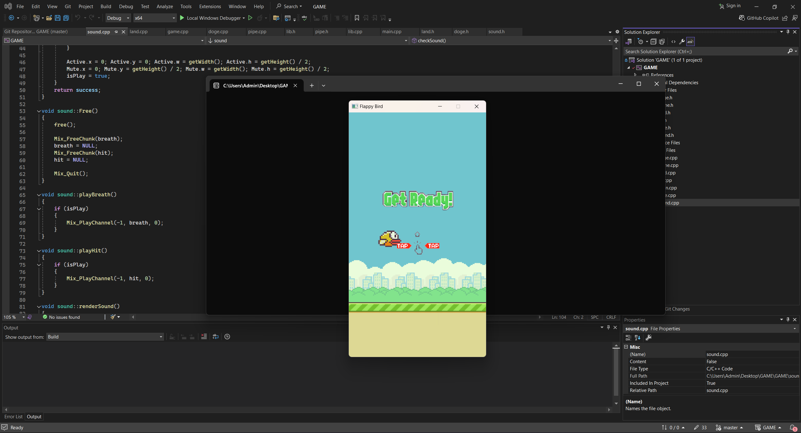

# Flappy Bird

## Giới thiệu chung
- **Họ và tên**: Phạm Văn Đức
- **MSSV**: 22024561
- **Lớp học phần**: 2324H_INT2215_70
- **Tên sản phẩm**: Flappy Bird

## Lời nói đầu
Flappy Bird là một trò chơi điện tử đơn giản nhưng vô cùng gây nghiện, được phát triển bởi Nguyễn Hà Đông. Người chơi điều khiển một chú chim bay qua các khe hẹp giữa những chiếc ống, với mỗi lần nhấn, chú chim sẽ bay lên một chút và trọng lực sẽ kéo chú chim xuống. Mục tiêu của trò chơi là đạt được số điểm cao nhất có thể bằng cách vượt qua nhiều ống nhất mà không va chạm vào chúng. Mặc dù gameplay cực kỳ đơn giản, Flappy Bird đã trở thành một hiện tượng toàn cầu nhờ độ khó đầy thử thách và khả năng khiến người chơi luôn muốn thử lại mỗi khi thất bại.

## Cách cài đặt game
Bước 1: Clone repo 
hoặc chọn code -> Download Zip ở link github https://github.com/ducpter/GAME

Bước 2: Bấm vào file GAME.sln dự án sẽ tự động mở trong Visual Studio.
Bước 3: Bấm vào Local Windows Debugger để khởi động game

## Cách chơi game

1. **Khởi động trò chơi**:
   - Khi bắt đầu, chú chim sẽ xuất hiện trên màn hình, sẵn sàng để bay. 
   - Người chơi có thể nhấn vào phím SPACE, chuột trái hoặc KEY_UP để bắt đầu.

2. **Điều khiển chú chim**:
   - Mỗi lần người chơi nhấn phím SPACE, chuột trái hoặc KEY_UP, chú chim sẽ bay lên một đoạn ngắn. 
   - Nếu không nhấn, chú chim sẽ rơi xuống do trọng lực.

3. **Mục tiêu**:
   - Điều khiển chú chim bay qua các khoảng trống giữa các cột ống và tránh va chạm với chúng.
   - Mỗi cột ống mà chú chim vượt qua thành công sẽ mang về cho người chơi 1 điểm.

4. **Trò chơi kết thúc**:
   - Trò chơi sẽ kết thúc nếu chú chim va chạm vào cột ống hoặc rơi xuống đất.
   - Sau khi trò chơi kết thúc, số điểm đạt được sẽ được hiển thị. 
   - Người chơi có thể chọn chơi lại để cải thiện số điểm của mình.

5. **Tính năng thêm**:
   - Tính năng cột di chuyển: các cột trong game sẽ có tỉ lệ có thể di chuyển tăng độ khó cho game.
   - Có thể tắt bật âm lượng, đổi giữa bản đồ sáng và tối.
   - Khi trò chơi kết thúc sẽ có thêm huy chương phù hợp để tôn vinh người chơi.

## Các thông tin chi tiết
1. **Nhân vật chính**: Flappy Bird.
   
   Và Flappy Bat
    
3. **Vật cản**: ống nước (có tỉ lệ sẽ di chuyển được).
   
4. **Cách thức điều khiển**: Sử dụng phím SPACE, chuột trái hoặc KEY_UP.
5. **Âm thanh**: Có âm thanh mô phỏng các hành động của chú chim trong game.
6. **Chức năng khác**: Chơi lại, đổi nhân vật tương ứng với map, lưu lại điểm cao,...

## Một vài hình ảnh từ game
1. **Khi bắt đầu game**
   
2. **Khi chơi game**
   ***Map sáng***
      
   ***Map tối***
      
   ***pause_tab có thể điều chỉnh map sáng tối và bật tắt âm thanh***
      ****pause_tab với map sáng****
         
      ****pause_tab với map tối****
         
      ****pause_tab với âm thanh bật****
         
      ****pause_tab với âm thanh tắt****
         
3. **Khi kết thúc**
   ***Huy chương cổ vũ***
      
   ***Huy chương bạc***
      
   ***Huy chương vàng***
      
   

## Các kỹ thuật được sử dụng
- Thư viện **SDL2** (hình ảnh, âm thanh, font chữ).
- Tạo và quản lý nhiều đối tượng như: con chim, background, menu,...
- Áp dụng các tính kế thừa, đa hình trong lập trình hướng đối tượng.
- Lưu và ghi điểm cao thông qua file.
- Tính toán vật lý để mô phỏng độ rơi và góc nghiêng của con chim.
- Xử lý thời gian thực, thao tác chuột, âm thanh, hình ảnh và bàn phím.

## Các nguồn tham khảo
- Hình ảnh và âm thanh tìm kiếm trên Google và tham khảo 1 số nguồn trên github.
- [LazyFoo SDL Tutorial](https://lazyfoo.net/tutorials/SDL/index.php)
- [Askari Hassan's YouTube Channel](https://www.youtube.com/channel/UC2Ab_b49frkmgFJajOvtkpw)
- https://github.com/conglb/Flappy-Bird

## Tổng kết

### Những kiến thức đã học được
- Hiểu được cách chia, tách file.
- Thành thạo lập trình hướng đối tượng, đặc biệt là việc sử dụng class.
- Nâng cao kỹ thuật lập trình.
- Học cách thiết lập môi trường làm việc với thư viện ngoài.
- Chương trình dễ dàng refactor và cập nhật.

### Những điều mong muốn cải thiện
- Hệ thống chọn nhân vật.
- Phát triển chế độ Multiplayer.
- Sử dụng AI để con chim có thể tự động vượt qua chướng ngại vật.
